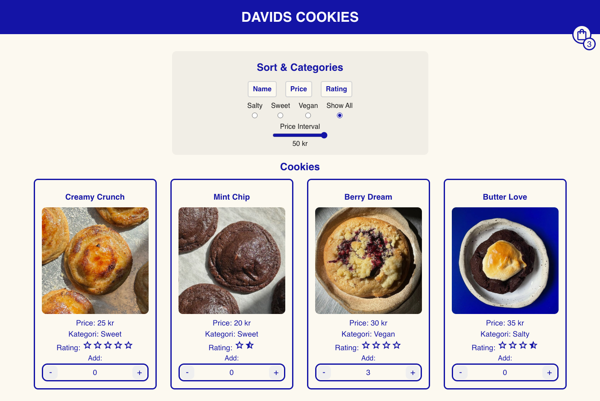

# Davids Cookies - Javascript Assignment

**Author:** David Kjellstrand

Hey! Welcome to Davids Cookies, a Javascript-focused assignment I did while studying the Front End Developer Program at Mediainstitutet. This was the first time I used Javascript but it went well and I had alot of fun while learning! Hava a look!

The site is a small webshop selling cookies of all kinds. There are sorting functions, updating products and arrays, discounts depending on time and day, validating forms with Javascript and much more!

## 🔗 Links

#### Repo
https://github.com/Medieinstitutet/fed24d-js-intro-inl-1-webshop-Davkje

#### Live Site
https://medieinstitutet.github.io/fed24d-js-intro-inl-1-webshop-Davkje/

## Tech Stack

**Languages:** JavaScript, Html, Css, Sass, 

## Studied Topics:

-  Focus on Javascript, less on CSS
- Logic & Program flow
- Comments and self-documenting code
- High code quality, conventions
- Conditions (if statements)
- Events
- DOM manipulation
- Functions
- Variables
- Arithmetic
- Objects
- Arrays
- Timers
- Loops
- Dates

## Design/Wireframe

## Validations

**HTML:** 

**CSS:**

**LIGHTOUSE:** 

## Thanks for "reading-me"!